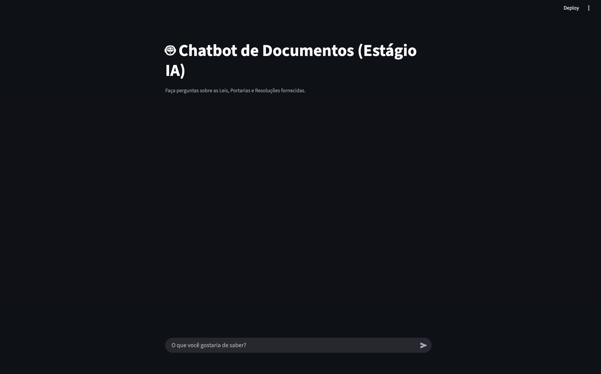
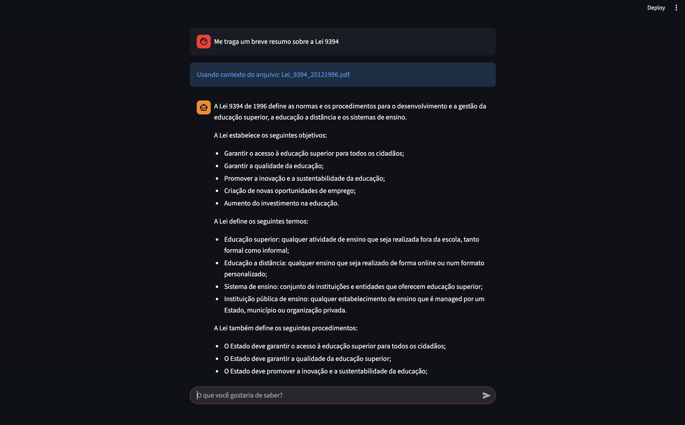
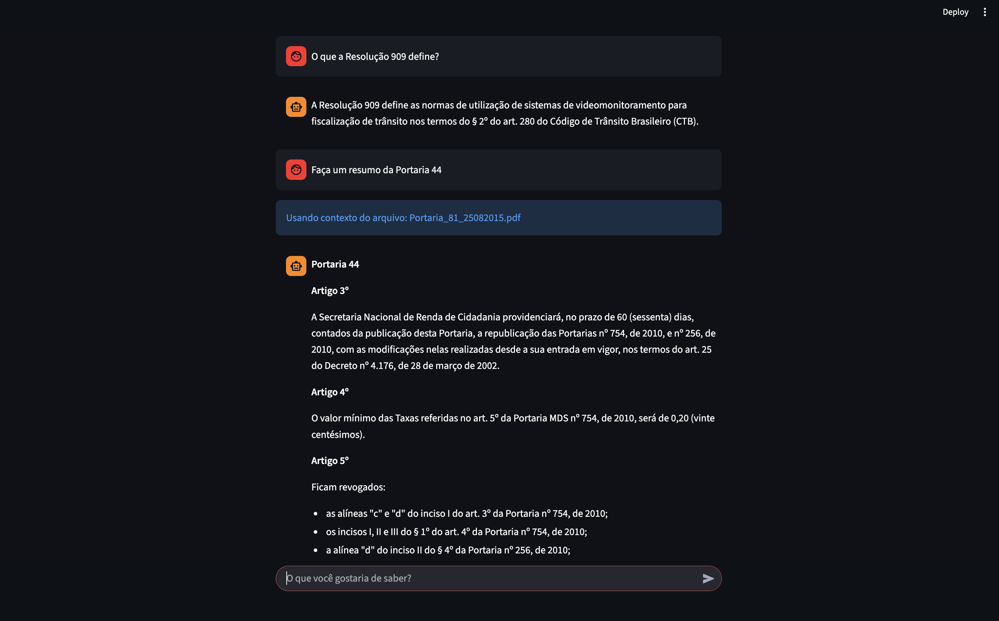
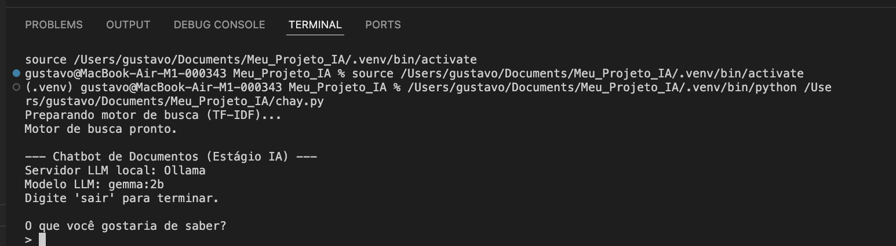

# Estudo de Caso - Estágio em Dados e IA

Este projeto implementa uma solução de busca e chat RAG (Retrieval-Augmented Generation) para consulta de documentos PDF, conforme especificado no estudo de caso.

A solução oferece duas interfaces para interação:
1- Um chat direto no terminal (via chat.py).
2- Uma interface gráfica web (via app.py com Streamlit).

## Objetivos Cumpridos

* **1. Extração de Texto:** O script `processar.py` usa a biblioteca PyMuPDF para extrair o texto completo de todos os PDFs na pasta `/dados`.
* **2. Classificação:** O `processar.py` classifica os documentos (Lei, Portaria, Resolução) com base no nome do arquivo e salva a extração no `documentos.json`.
* **3. Busca por Linguagem Natural:** O script `buscar.py` usa `scikit-learn` (TF-IDF) para criar um motor de busca que encontra os documentos mais relevantes para a consulta do usuário.
* **4. Chat com LLM Local:** O script `chat.py` utiliza o Ollama para rodar um LLM local (`gemma:2b`), que responde perguntas do usuário com base no contexto encontrado pela busca (RAG).

## Galeria do Projeto

Uma prévia das Interfaces do sistema em execução.

| Visão Geral das Interfaces | Interface Gráfica e Chat Terminal |
| :---: | :---: |
|  |  |
| **Definição e Resumo** | **Chat no Terminal** |
|  |  |


## Stack de Tecnologias

* **Python 3.10+**
* **Extração PDF:** PyMuPDF (`fitz`)
* **Busca (Objetivo 3):** Scikit-learn (`TfidfVectorizer`, `cosine_similarity`)
* **Interface Web:** Streamlit
* **LLM Local (Objetivo 4):** Ollama
* **Comunicação LLM:** `ollama` (biblioteca Python)

## Como Executar 

A solução foi desenhada para rodar localmente, sem necessidade de GPU. 

### 1. Pré-requisito: Ollama

Este projeto requer o [Ollama](https://ollama.com) para rodar o LLM local.

1.  Baixe e instale o Ollama do site oficial.
2.  Após a instalação, puxe o modelo leve que será usado (Gemma 2B):
    ```bash
    ollama pull gemma:2b
    ```
3.  Deixe o Ollama rodando.

### 2. Configuração do Projeto Python

1.  Clone este repositório:
    ```bash
    git clone [URL-DO-SEU-REPOSITORIO]
    cd [NOME-DO-SEU-REPOSITORIO]
    ```

2.  Crie e ative um ambiente virtual (venv):
    ```bash
    python -m venv .venv
    source .venv/bin/activate  # (ou .\.venv\Scripts\activate no Windows)
    ```

3.  Instale as dependências:
    ```bash
    pip install -r requirements.txt
    ```

### 3. Execução

1.  **Processar os PDFs (Obrigatório na primeira vez):**
    Este script cria o arquivo `documentos.json` que o chat precisa.
    ```bash
    python processar.py
    ```

## Depois de processar, você pode escolher qual interface deseja usar:**

1. Iniciar a Interface Gráfica (Streamlit)
Execute o script app.py para iniciar uma interface web local no seu navegador.
```bash
streamlit run app.py
```
O Streamlit abrirá automaticamente o aplicativo no seu navegador.

2. Iniciar o Chat no Terminal (Simples)
Execute o script chat.py para interagir diretamente no seu terminal.
```bash
python chat.py
```
Faça suas perguntas e digite 'sair' para terminar.

